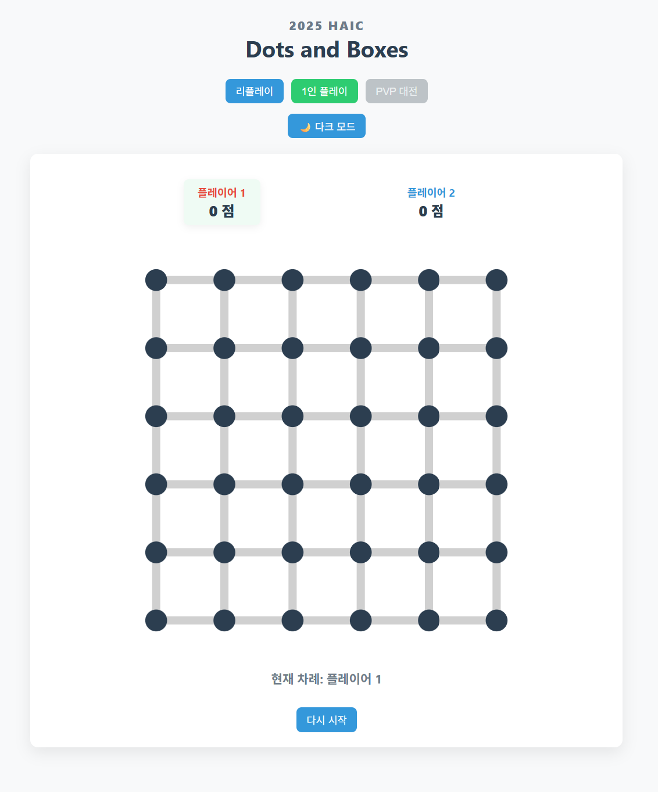

# Dots And Boxes Agent

This repository contains our Dots and Boxes agent developed for **HAIC 2025 (Hanyang Artificial Intelligence Challenge)**.  
We achieved **2nd place** in the competition.

Our agent’s strength comes mainly from a **search algorithm**, 
and this repo is a **refactored version** of the experimental environment we used during the challenge.

## How to run our code
**environment setting**
``` bash
pip install -r requirements.txt
# Tested with Python 3.10
```
**How to run experiments**
``` bash
python run_experiments.py --human -p [CONFIG_PATH or CONFIG_DIR]
```

Example:

- If you pass **a JSON file,** it runs that experiments only:
``` bash
python run_experiments.py -p config/exp_configs/version_comparison/v0_random_vs_v0_random.json
```

- If you pass **a directory**, it runs all *.json configs in that directory:
``` bash
python run_experiments.py -p config/exp_configs/version_comparison
```
- To render the GUI, run with the --human flag:
``` bash
python run_experiments.py --human -p config/exp_configs/version_comparison
```

**How to Play against our AI**
``` bash
python play_with_ai.py -p [POCLICY_CONFIG_PATH] --agent_first
```

POLICY_CONFIG is also a **single JSON file**
With the --agent_first flag, the agent will play as the first player.
If it runs Successfully, GUI based on pygame will show up.

## Game Environment
environment is same as the challenge has provided

- **Board size**: **5 x 5 Boxes**(6 x 6 dots)


- **Time Limit**: **24 seconds** per game
- **Hardware**: **CPU only** Environment. GPU is not allowed
## Project Structure
[Go to Project Structure](project_structure.md)

## Experiment Result
[Go to experiment result analysis](experiment_result_analysis.md)

## Future Work / Possible Improvements

**1. Stronger and more principled heuristics**
- Our experiments show that most of the additional handcrafted heuristics we tried doesn't show much improvement.
- So For improvement. We need to explore:
    - **Better mid-game evaluation** (e.g., chain/junction heuristics)
    - **Tighter integration between search and Dots and Boxes theory**

**2. Neural Network–based agent**

- Due to the CPU-only constraint in the challenge environment, we could not - fully utilize GPU-based neural networks.
- However, prior work such as **AlphaZero** and **MuZero** suggests that NN-based methods can perform extremely well.
- We would like to:
    - Train a value/policy network for Dots and Boxes
    - Compare a **pure search-based agent vs a NN-augmented search agent** (AlphaZero-style)


