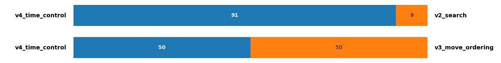
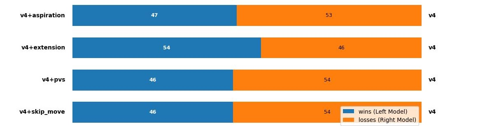
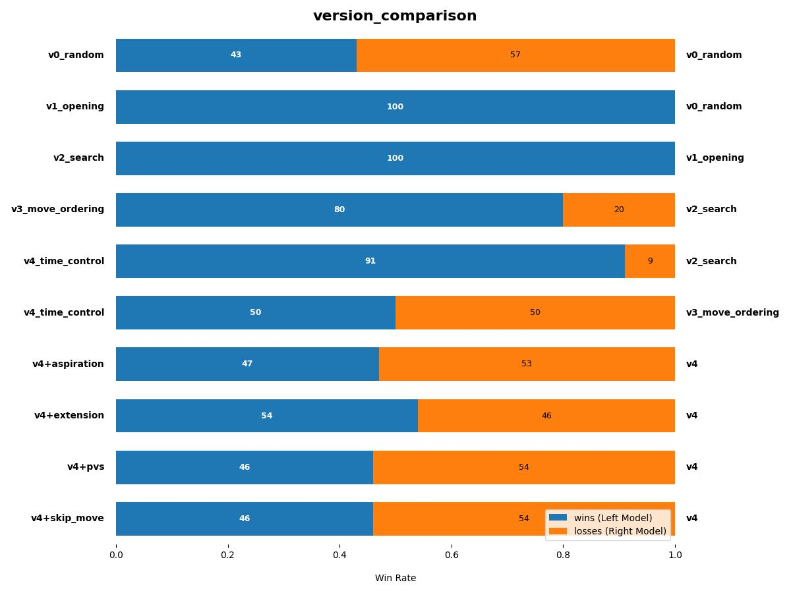
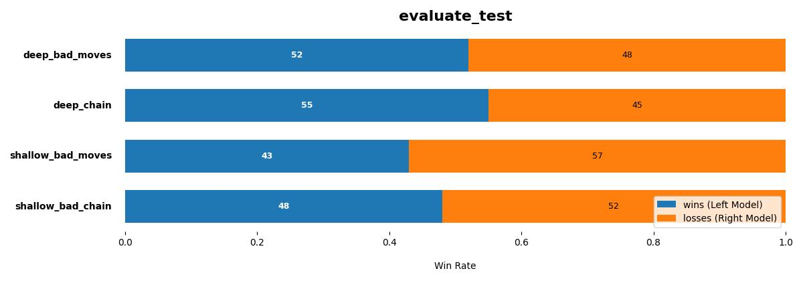

# experiment_result_analysis

## v1 Policy - Opening Policy

v1은 간단한 규칙 기반 오프닝 정책으로, 초반에는 **안전한(Safe) 수만 선택하여 상대에게 유리한 구조를 열어주지 않는 방식**으로 플레이한다. 
랜덤 정책 대비 승률 100%를 기록했다.

---

## v2 Policy - Search Engine (ID + TT + Alpha–Beta Search)

v2에서는 본격적인 서치 기반 접근을 도입했다. Iterative Deepening, Transposition Table, Alpha–Beta Search를 조합하며 탐색의 안정성과 깊이를 동시에 확보했다. 
이번에도 이전 버전 대비 100%의 승률을 보여주었다.

---

## v3 Policy - Move Ordering 적용

v3에서는 Move Ordering을 적용하여 유망도가 높은 수부터 탐색하도록 구조를 크게 개선했다. 그 결과 탐색 효율이 대폭 향상되었고, 평균 탐색 깊이도 **7 → 15**로 증가했다.

---

## v4 Policy - Time Control 추가

v4에서는 턴별 시간 배분(Time Control)을 도입하여 초반에는 적은 시간을 사용하고, 미들게임과 엔드게임으로 갈수록 더 많은 시간을 투자하도록 조절했다. 이러한 시간 배분 전략 덕분에 v2 대비 **90%**, v3 대비 **10%** 더 나은 성능을 기록하였다.

하지만 흥미롭게도, v3와 v4가 서로 맞붙었을 때는 승률이 **50%로 수렴**하는 현상이 나타났다. 이는 단순히 탐색 깊이를 증가시키는 것만으로는 성능이 더 이상 개선되지 않는 구조적 한계를 시사한다.

---

## 추가 실험: Aspiration, PVS, Skip Move, Extension

탐색 최적화를 위해 Aspiration Window, PVS, Skip Move, Extension 등 다양한 기법을 도입해 보았다. 실질적인 성능 향상으로 이어지지는 않았다.

---

# 서치 성능 수렴 분석

v3와 v4가 서로에게 50%의 승률을 기록한 이유를 분석한 결과, **특정 탐색 깊이 이상에서는 더 이상 유의미한 성능 향상이 발생하지 않는 수렴 구간**이 존재함을 확인했다.

이러한 현상의 배경에는 Dots and Boxes의 구조적 특징이 자리한다.

- 약 **t ≈ 30** 이후의 후반부는 거의 완전히 **Deterministic**한 형태가 된다.
- 엔드게임은 답이 명확한 경우가 대부분이라, 탐색 깊이를 늘려도 결과가 잘 바뀌지 않는다.
- 실제 승패가 갈리는 구간은 미들게임이지만, 이 구간은 **분기수가 급격히 증가해 탐색 비용이 매우 크다**.

즉, 엔드게임에서는 충분히 강한 정책을 보여도, 미들게임의 복잡도를 해결하지 못하면 전체 성능이 수렴하는 구조적 한계에 부딪히게 된다.

이를 해결하기 위해 다음과 같은 방향을 고려할 수 있다.

### 1. 고성능 언어(C++ 등)로의 이전

파이썬의 속도 한계를 벗어나 보다 깊은 미들게임 탐색을 가능하게 한다.

### 2. 엔드게임 정보를 반영하는 Evaluate 개선

체인 구조나 CV와 같은 엔드게임 지표를 미들게임 평가에 적극적으로 반영해, 단순 점수 기반 평가보다 더 멀리 내다보는 정책을 만든다.

### 3. Neural Network 기반 Policy 도입

딥러닝 기반 정책 모델을 활용해 미들게임의 선택 품질을 높이면, 탐색 분기수를 효과적으로 줄여 서치 효율 또한 개선될 수 있다.

---

# 평가 함수 실험(Evaluation Functions)

마지막으로, 다양한 평가 함수를 적용하여 서치 성능이 어떻게 달라지는지 비교 실험을 진행하였다. 사용한 평가는 다음과 같다.

### 1. evaluate_bad_moves
박스의 세 변을 채워 상대에게 점수를 내주는 위험한 수의 개수를 계산하여 패널티로 주는 방식.

### 2. evaluate_chain
Chain 구조의 길이를 리스크로 간주하여, 긴 체인이 형성될 가능성이 높은 상태에 패널티를 부여하는 방식.

두 평가는 낮은 탐색 깊이와 높은 탐색 깊이 모두에서 비교되었으며, 전략적 성향 차이가 실제 성능에 어떤 영향을 미치는지 분석하였다.

실험 결과는 전반적으로 **유의미한 차이라고 보기 어려웠다.**, 약간 더 좋거나 약간 더 나쁜 정도의 차이를 보였으나 **100개의 제한적인 샘플 수로는 신뢰도 있는 결과라고 생각하기 어렵다.**